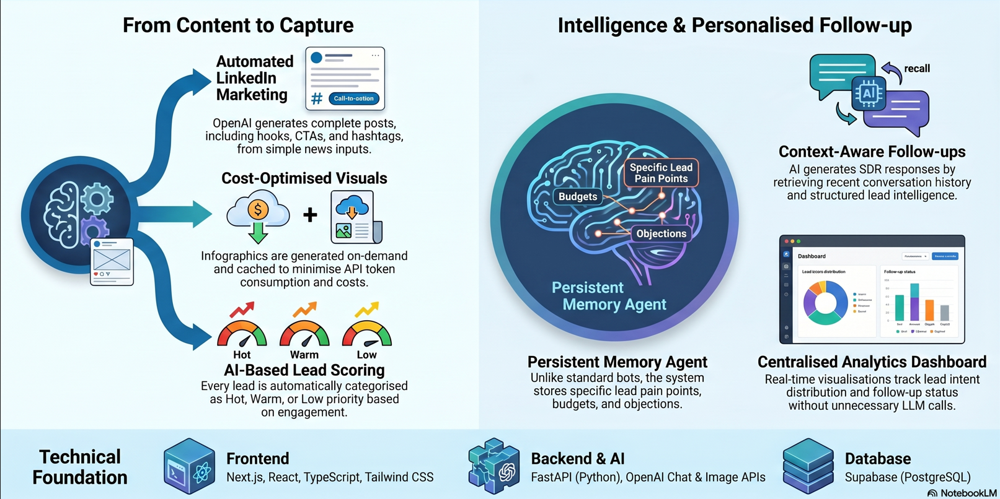
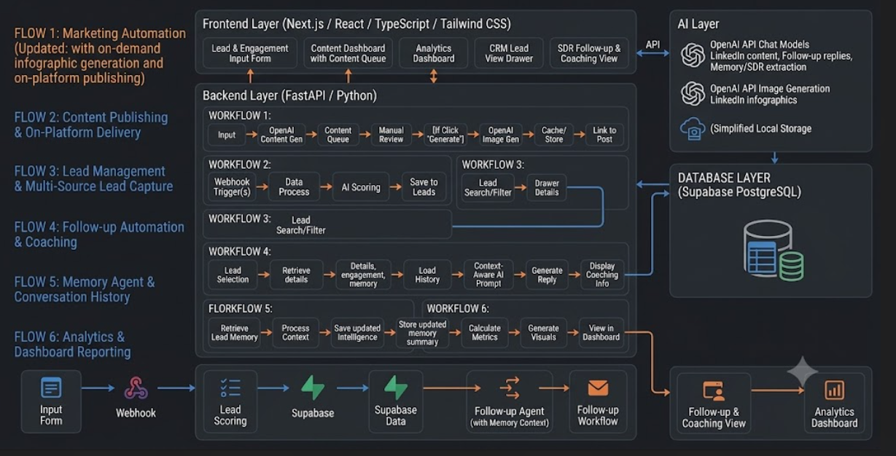

# CRM & Marketing Automation System

An AI-powered CRM and Marketing Automation platform that streamlines **content generation, lead management, intelligent follow-ups, and analytics** using **OpenAI, FastAPI, Next.js, Supabase, and persistent memory systems**.

---

## 🎥 Demo Video

---

## 🏗️ System Architecture

---

---

## ✨ Key Features

### 🤖 AI-Powered Content Generation
- Generate complete LinkedIn posts using OpenAI
- AI-generated hooks, CTAs, and hashtags
- Content approval workflow
- Draft, approve, reject, and publish management

---

### 🎨 AI Infographic Generation

- Generate professional LinkedIn infographics on demand
- Uses OpenAI Image Generation API
- Smart caching system to reduce API costs
- Regenerate images when needed
- Download generated graphics directly

---

### 🎯 AI Lead Scoring

Automatically categorizes leads into:

- 🔥 Hot
- 🟠 Warm
- 🟢 Low

based on engagement quality and AI analysis.

Lead qualification includes:

- Intent
- Priority
- Score
- AI reasoning
- Recommended action

---

### 👥 Lead Management

- Centralized lead dashboard
- Search and filtering
- Lead drawer with complete information
- Activity timeline
- Delete and manage leads
- Company and role tracking

---

### 💬 AI Follow-up Automation

Generate personalized SDR follow-up replies using:

- Lead details
- Previous conversations
- Engagement history
- Memory summary
- Buying intent
- Pain points

instead of generic prompts.

---

### 🧠 Persistent Memory Agent

Unlike traditional chatbots, the system maintains long-term memory for every lead.

It automatically extracts and stores:

- Buying Intent
- Urgency
- Pain Points
- Objections
- Budget
- Decision Maker
- Preferred Communication
- Next Action

allowing future replies to be context-aware.

---

### 📚 Conversation Memory

Every interaction is stored and retrieved automatically.

The AI recalls:

- Previous replies
- User questions
- Conversation history
- Lead intelligence

to generate more natural and personalized responses.

---

### 📊 Analytics Dashboard

Real-time dashboards provide insights into:

- Lead distribution
- Hot vs Warm vs Low leads
- Follow-up status
- Conversion opportunities
- Engagement metrics
- AI-generated visual analytics

without requiring unnecessary LLM calls.

---

### 👁️ Computer Vision & OCR

Supports AI-powered document understanding using:

- OpenAI Vision Models
- OCR extraction
- Image-to-text processing
- Legal document analysis
- Structured information extraction

---

### 🔔 Smart Notifications

Automatically tracks:

- Pending follow-ups
- High-priority leads
- Workflow status
- CRM activities

for improved sales operations.

---

## 🛠️ Tech Stack

### Frontend

- Next.js
- React
- TypeScript
- Tailwind CSS

### Backend

- FastAPI
- Python

### AI

- OpenAI Chat Models
- OpenAI Image Generation
- OpenAI Vision (OCR & Document Analysis)

### Database

- Supabase PostgreSQL

### Storage

- Local Image Cache
- Persistent Memory Store

---

## 🧩 Core AI Modules

- ✅ LinkedIn Content Generator
- ✅ AI Infographic Generator
- ✅ Lead Qualification Agent
- ✅ Persistent Memory Agent
- ✅ Follow-up Agent
- ✅ Conversation Memory Service
- ✅ Analytics Generator
- ✅ Computer Vision & OCR Pipeline

---

## 📂 Main Workflows

### 1. Content Marketing

News → AI Content Generation → Approval Queue → On-demand Infographic → Publish

### 2. Lead Capture

Engagement → AI Lead Scoring → CRM → Lead Management

### 3. Follow-up Automation

Lead → Memory Retrieval → Conversation History → Context-Aware Prompt → AI Reply

### 4. Memory System

Conversation → Memory Extraction → Memory Summary → Future Context Retrieval

### 5. Analytics

CRM Data → Processing → Dashboard Metrics → Visual Reports

---

## 🚀 Highlights

- 🧠 Persistent AI Memory
- 💬 Context-aware Follow-ups
- 🎨 On-demand AI Infographics
- 👁️ Computer Vision & OCR
- 📊 Real-time Analytics
- 🎯 AI Lead Qualification
- ⚡ Cost-optimized Image Caching
- 🔄 End-to-end Marketing Automation

---

## 📜 License

This project was developed as an AI-powered CRM & Marketing Automation platform demonstrating modern Generative AI, Retrieval-Augmented Memory, Computer Vision, and Full-Stack SaaS architecture.
